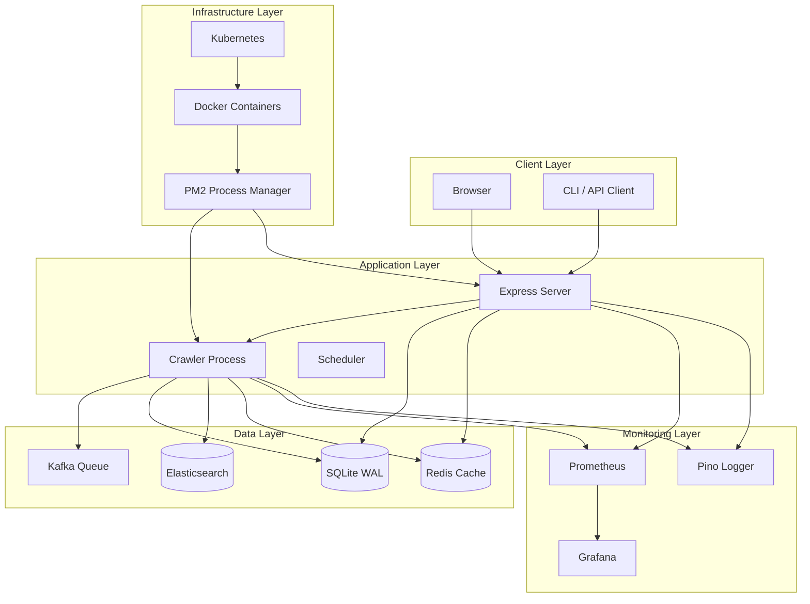
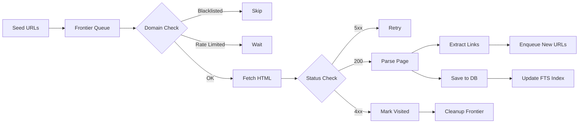
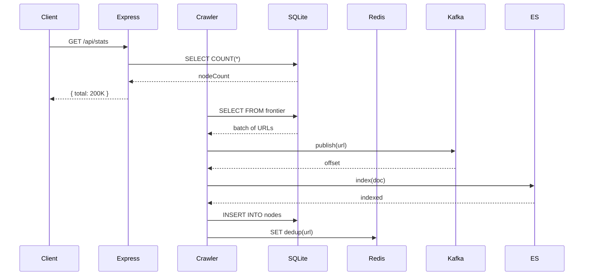
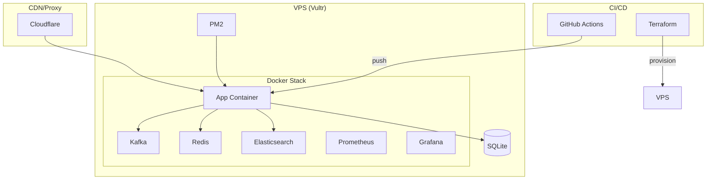
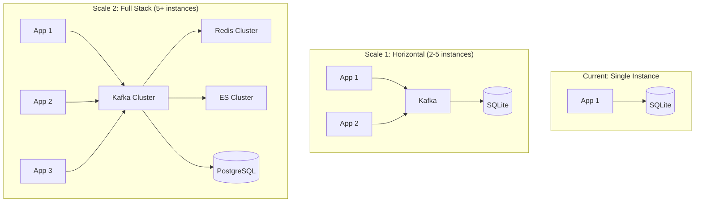

# WebIndexer Architecture

## High-Level Architecture



## Crawl Pipeline



## Data Flow



## Deployment Architecture



## Security Architecture

```mermaid
graph TB
    subgraph "Perimeter"
        CF[Cloudflare WAF]
        RateLimit[Rate Limiter]
    end

    subgraph "Application"
        CSP[CSP Headers]
        Input[Input Validation]
        Auth[Request ID]
    end

    subgraph "Data"
        SQLite WAL[SQLite WAL]
        Redis Auth[Redis Auth]
        Secrets[.env Secrets]
    end

    CF --> RateLimit
    RateLimit --> CSP
    CSP --> Input
    Input --> Auth
    Auth --> SQLite WAL
    Auth --> Redis Auth
    Secrets --> App
```

## Scaling Architecture


